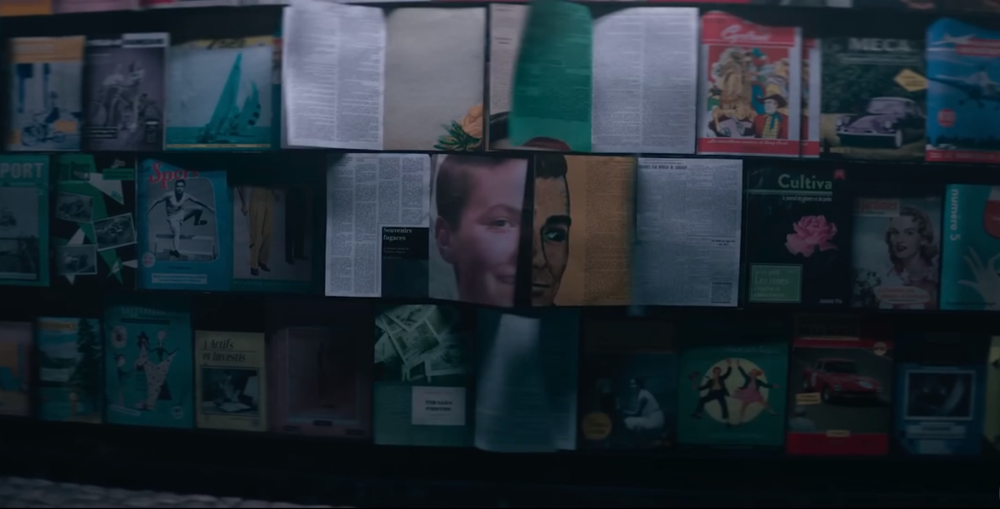
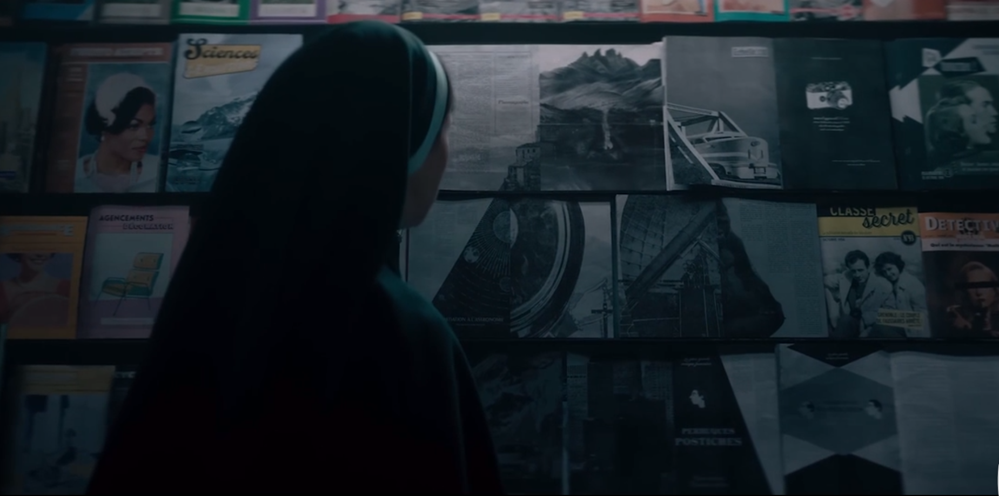
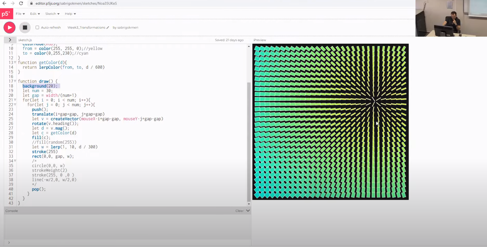

# xden2770_9103_tut4
### Week 8 Quiz

**Part 1** 

The imaging technique that I find inspiring for my assignment is from the movie "Nun II." There's a scene that I find very creative: the magazines in the magazine stand turn over by themselves, and eventually, they stop on certain pages, where the pictures on those pages and form the shape of a nun. I want to use the technique of assembling large patterns from small images in my project. It can not only flip itself but also allow users to manipulate small images to create different faces, it must be a fun thing to do.

**Part 2**

I believe that image processing coding techniques could assist in implementing the image technique. To achieve the desired result, I will first gather many images of different faces from the same angle and position. Then, I will use the `image()` function to extract different parts from various images and assemble them into a complete image. To animate every part of the face, I plan to employ transformation techniques to achieve the turning effect. Here is the video of the coding tutorial https://www.youtube.com/watch?v=GZOrpJ-GNiY&t=1639s (the code is just showed in the video) 
